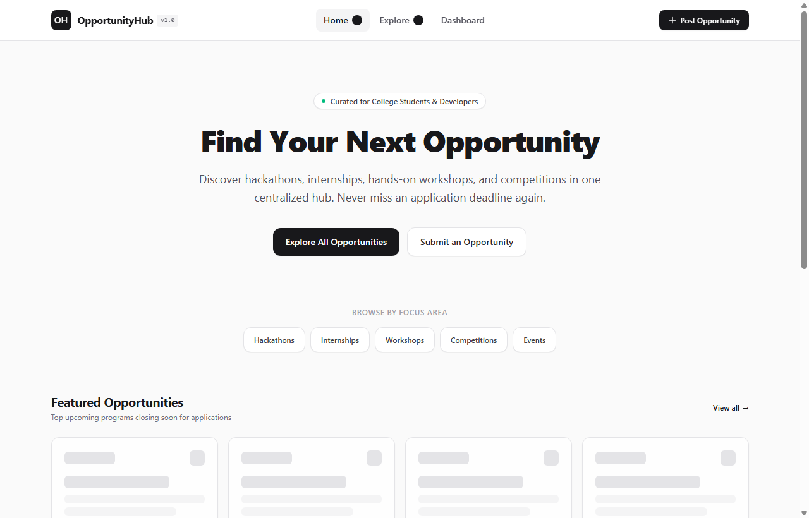
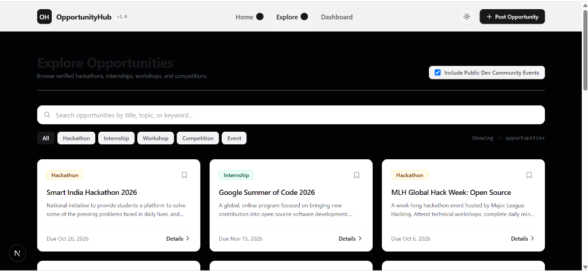
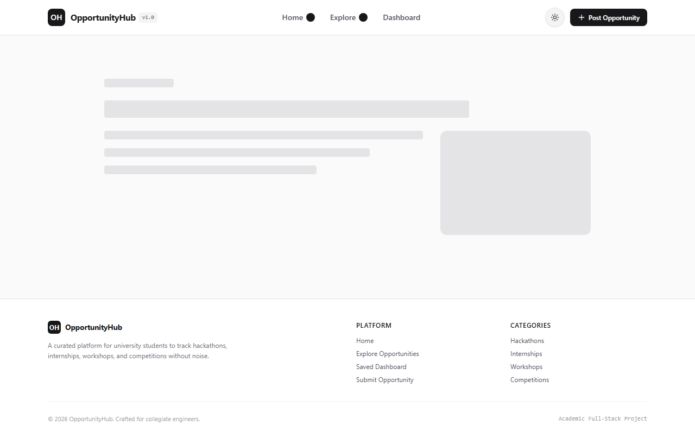
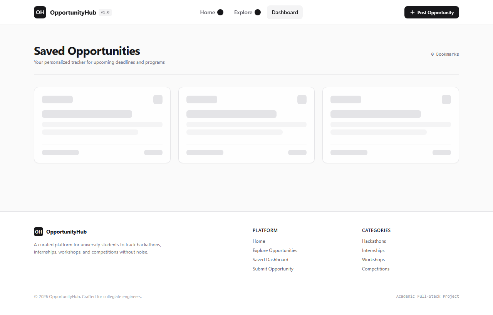
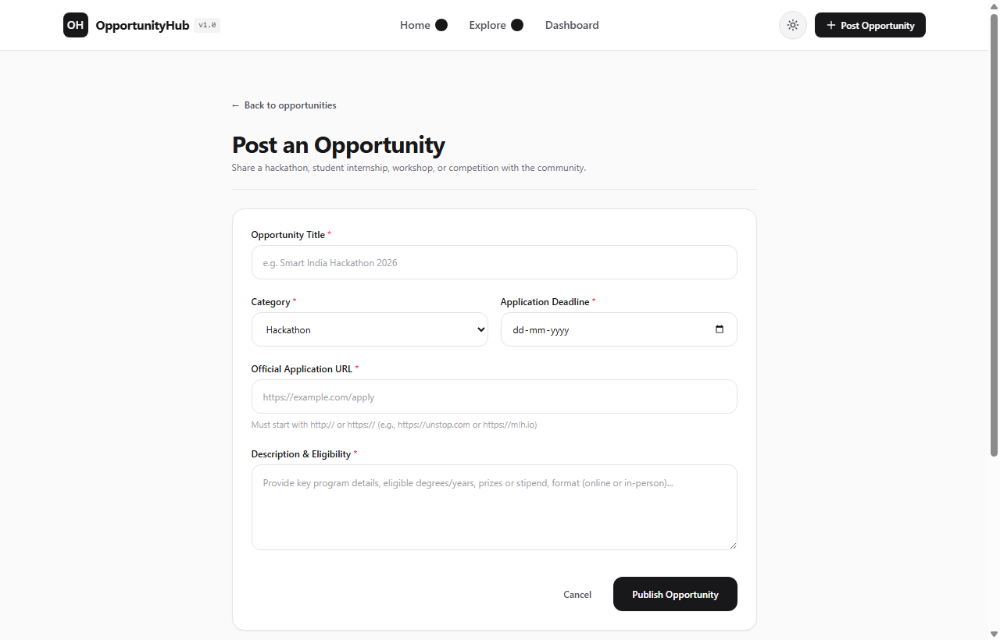

# OpportunityHub

OpportunityHub is a full-stack web application built for university students to discover, track, bookmark, and submit hackathons, internships, workshops, and competitions.

The project addresses the challenge students face with opportunities scattered across Discord channels, WhatsApp groups, and disparate websites by providing a centralized, noise-free directory with dynamic deadline tracking.

---

## User Interface Screenshots

### 1. Landing Page
Centralized hero section, focus area quick links, and featured upcoming opportunities.



### 2. Explore Directory
Search bar with real-time keyword filter, category pills, and community event integration toggle.



### 3. Opportunity Details
Detailed program overview, eligibility requirements, application deadlines, and direct official application link.



### 4. Saved Dashboard
Personalized tracker displaying bookmarked opportunities with urgency badges and one-click removal.



### 5. Opportunity Submission Portal
Community submission form with validation for title, category, application URL, deadline, and description.



---

## Features

- **Centralized Directory**: Filter opportunities by Hackathon, Internship, Workshop, Competition, or Event.
- **Search & Filters**: Real-time keyword filtering across opportunity titles and descriptions with URL state persistence.
- **Public API Feed Integration**: Option to include technical events fetched from an external developer community API.
- **Urgency & Deadline Tracking**: Dynamic countdown showing remaining days until application deadlines, with urgent tags for programs closing within 3 days.
- **Personal Bookmark Tracker**: Client and server synchronized bookmark manager with live navbar counter.
- **Submission Form**: Client and server validated form to submit new student opportunities.
- **View Transitions & Dark Mode**: Smooth circular ripple theme toggle between light and dark mode adhering to high-contrast neutral styling.

---

## Technical Stack

- **Framework**: Next.js (App Router)
- **Language**: TypeScript
- **Frontend**: React, Tailwind CSS, GSAP
- **Database**: MongoDB with Mongoose ORM
- **State & Theme**: React 19 `useSyncExternalStore` and View Transitions API
- **CI/CD**: GitHub Actions workflow

---

## Project Structure

```text
opportunity-hub/
├── app/
│   ├── api/
│   │   ├── external/          # Public API integration route
│   │   ├── opportunities/     # Opportunity CRUD endpoints
│   │   ├── saved/             # Bookmark management endpoints
│   │   └── seed/              # Database seeding route
│   ├── add/                   # Submit opportunity page
│   ├── dashboard/             # Saved opportunities tracker page
│   ├── explore/               # Searchable opportunity catalog page
│   ├── opportunities/[id]/    # Single opportunity detail page
│   ├── globals.css            # Tailwind configuration and theme variables
│   ├── layout.tsx             # Root layout wrapper
│   └── page.tsx               # Homepage
├── components/
│   ├── CardNav.tsx            # Mobile animated card navigation (React Bits + GSAP)
│   ├── CardNav.css            # Styles for mobile card navigation
│   ├── CategoryBadge.tsx      # Neutral grey oval category badge
│   ├── EmptyState.tsx         # Reusable empty state view
│   ├── FilterBar.tsx          # Search bar and category filters
│   ├── Footer.tsx             # Page footer
│   ├── Navbar.tsx             # Desktop navbar and mobile layout switch
│   ├── OpportunityCard.tsx    # Opportunity listing card
│   ├── SkeletonCard.tsx       # Loading skeleton UI
│   └── ThemeToggle.tsx        # View Transition theme switcher
├── lib/
│   ├── dbConnect.ts           # Cached Mongoose connection singleton
│   ├── mockData.ts            # Fallback dataset for offline testing
│   └── types.ts               # Shared TypeScript definitions
├── models/
│   ├── Opportunity.ts         # Mongoose schema for opportunities
│   └── SavedOpportunity.ts    # Mongoose schema for bookmarks
├── screenshots/               # Application UI screenshots
├── .gitignore                 # Git ignore configuration
├── next.config.ts             # Next.js configuration
├── package.json               # Dependencies and scripts
└── tsconfig.json              # TypeScript configuration
```

---

## Getting Started

### Prerequisites

- Node.js 18.18 or higher (Node.js 20 recommended)
- npm, yarn, or pnpm
- MongoDB instance (local or MongoDB Atlas)

### Setup Instructions

1. **Clone the repository**:
   ```bash
   git clone https://github.com/garvnijhawan24-sys/oppurtunity_hub.git
   cd oppurtunity_hub
   ```

2. **Install dependencies**:
   ```bash
   npm install
   ```

3. **Environment Setup**:
   Create a `.env.local` file in the project root:
   ```env
   MONGODB_URI=mongodb://localhost:27017/opportunity_hub
   ```
   *Note: If no database connection string is provided, the application automatically uses a local fallback dataset so all features remain testable.*

4. **Run the Development Server**:
   ```bash
   npm run dev
   ```
   Open `http://localhost:3000` in your browser.

5. **Build for Production**:
   ```bash
   npm run build
   npm run start
   ```

---

## Verification Commands

To verify type safety, code formatting, and build success:

```bash
# TypeScript type check
npx tsc --noEmit

# ESLint lint check
npm run lint

# Production build compilation
npm run build
```
